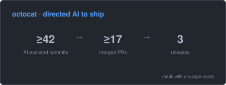

# ai-usage-cards

**The AI-era contribution graph.** Green squares showed *that* you code — this card shows *how you build with AI*: verifiable outcomes straight from your public git history, embeddable in your README from a single URL.

<p align="center">
  <picture>
    <source media="(prefers-color-scheme: dark)" srcset="docs/demo-dark.svg">
    
  </picture>
</p>

No install, no tokens, no data collection — the card reads AI co-author trailers
(`Co-Authored-By: Claude <...>` and friends) already sitting in your public commits and
aggregates them into an outcome funnel: **commits → merged PRs → releases**.

## Quick start

1. Open the [card builder](https://ai-usage-cards-swart.vercel.app) and type your GitHub username.
2. Click **Copy markdown**.
3. Paste into your README. Done — light/dark switches automatically.

Or paste this directly, replacing `YOUR_USERNAME`:

```html
<picture>
  <source media="(prefers-color-scheme: dark)" srcset="https://ai-usage-cards-swart.vercel.app/api/card?username=YOUR_USERNAME&theme=dark">
  
</picture>
```

## Options

| Parameter | Values | Default | Notes |
|---|---|---|---|
| `username` | GitHub login | *(required)* | |
| `modules` | `funnel`, `repos` (comma-separated) | `funnel` | All modules are opt-in — you choose what to show |
| `theme` | `light`, `dark`, `dim` | `light` | Unknown values fall back to `light` |

- **`funnel`** — the headline: `≥N AI-assisted commits → ≥M merged PRs → K releases`.
- **`repos`** — per-repo case cards (`spark-app — shipped v1.2.0 · ≥20 AI-assisted commits`), a unit you can paste next to a resume line.

## Themes

| `light` | `dark` | `dim` |
|---|---|---|
|  |  |  |

New themes are welcome — add a token record in [`src/render/themes.ts`](src/render/themes.ts) (single-hue, please).

## What counts (and what doesn't)

Honesty first — the numbers are framed as **"at least N"** because:

- Co-author trailers are **lost on squash merges** and can be disabled, so real usage is higher than what's visible.
- Only **public repos** and default branches are counted. Private work is invisible by design.
- Merged-PR resolution is sampled (bounded API usage), so `≥M` is a floor, not a census.

What is never shown: emails (matched internally, never rendered), token counts, costs,
or any leaderboard. This card shows *what you shipped with AI* — not how much AI you consumed.

## Show your usage too — the heatmap card

The outcome funnel is only half the story. The **usage card** is the AI-era contribution
graph itself: a heatmap of your actual daily AI usage across Claude Code, Codex, Gemini CLI,
and friends — with streaks, monthly totals, and a tool-share bar.

<p align="center">
  <picture>
    <source media="(prefers-color-scheme: dark)" srcset="docs/usage-dark.svg">
    
  </picture>
</p>

Your usage data lives only on your machine — no server can see it. So a tiny collector
script uploads **numeric summaries only** (dates, token counts, top model — never project
names, file paths, prompts, or costs) to a *gist* you own, and the card reads from there.

> **New to gists and tokens?** A **gist** is a tiny one-file storage space that comes free
> with your GitHub account — think of it as a public mailbox the card can read your numbers
> from. A **token (PAT)** is a limited-purpose password that lets the collector write to
> that mailbox — and nothing else. Follow the five steps below; it takes about five minutes.
> [한국어 가이드는 여기](docs/SETUP.ko.md).

**Step 1 — Create your gist.** Go to [gist.github.com](https://gist.github.com), type
`usage.json` as the filename and `{}` as the content, then click **Create secret gist**.
Look at your browser's address bar: `gist.github.com/you/`**`abc123...`** — that long code
is your **gist id**. Copy it.

**Step 2 — Create your token.** Open
[this pre-filled page](https://github.com/settings/tokens/new?scopes=gist&description=ai-usage-cards)
(only the `gist` permission is checked — leave it that way), click **Generate token**, and
copy the `ghp_...` string. It is shown only once.

**Step 3 — Run the collector once.** Needs [Node.js](https://nodejs.org) 20+. Download the
script and run it with your two values:

macOS / Linux:
```bash
curl -fsSLO https://raw.githubusercontent.com/JinVibe/ai-usage-cards/main/collector/collect.mjs
AIUC_GIST_ID=<gist-id> AIUC_GIST_TOKEN=<token> AIUC_SOURCE_ID=my-laptop node collect.mjs
```

Windows (PowerShell):
```powershell
curl.exe -fsSLO https://raw.githubusercontent.com/JinVibe/ai-usage-cards/main/collector/collect.mjs
$env:AIUC_GIST_ID="<gist-id>"; $env:AIUC_GIST_TOKEN="<token>"; $env:AIUC_SOURCE_ID="my-pc"; node collect.mjs
```

You should see `Uploaded N days as my-pc.json`.

**Step 4 — Embed your card.** Replace the two placeholders and paste into any README:

```
https://ai-usage-cards-swart.vercel.app/api/usage-card?username=YOUR_USERNAME&gist=YOUR_GIST_ID&theme=dark
```

Your gist id is safe to share — it only exposes the same numbers the card already shows.
Keep the token private.

Usage and combined card options:

| Parameter | Values | Default | Notes |
|---|---|---|---|
| `username` | GitHub login | *(required)* | |
| `gist` | your gist id | *(required)* | |
| `providers` | e.g. `claude-code,codex` | all | Show only the AI tools you actually use — totals, heatmap, and monthly bars all follow the filter |
| `theme` | `light`, `dark`, `dim` | `light` | |

The card leads with your **all-time total**, the **current month**, and a **month-by-month
breakdown** of the last six months.

**Step 5 — Automate it** so the card stays fresh:

<details>
<summary>macOS / Linux (cron)</summary>

```bash
crontab -e   # add this line (runs daily at 12:00):
0 12 * * * AIUC_GIST_ID=<gist-id> AIUC_GIST_TOKEN=<token> AIUC_SOURCE_ID=my-laptop node /path/to/collect.mjs
```
</details>

<details>
<summary>Windows (Task Scheduler)</summary>

Save this as `collect.cmd` somewhere private (e.g. `%USERPROFILE%\.ai-usage-cards\`):

```bat
@echo off
set AIUC_GIST_ID=<gist-id>
set AIUC_GIST_TOKEN=<token>
set AIUC_SOURCE_ID=my-pc
node "C:\path\to\collect.mjs"
```

Then register it (runs daily at 12:00):

```powershell
schtasks /create /tn "ai-usage-cards-collector" /tr "%USERPROFILE%\.ai-usage-cards\collect.cmd" /sc daily /st 12:00
```
</details>

<details>
<summary>Troubleshooting</summary>

- **`ccusage returned no daily data`** — the machine has no AI CLI logs yet (the collector
  reads Claude Code / Codex / Gemini CLI history). Use the AI tool once, then re-run.
- **`Gist update failed: 404`** — wrong gist id, or the token belongs to a different account.
- **`Gist update failed: 401/403`** — token expired or missing the `gist` scope; make a new one (Step 2).
- **Card says "No usage data collected yet"** — the collector hasn't succeeded yet; check Step 3's output.
</details>

Using more than one computer? Run Steps 3 and 5 on each, giving every machine a different
`AIUC_SOURCE_ID` — each updates only its own file in the gist, so nothing conflicts, and
machine names are never shown on the card. The collector wraps
[ccusage](https://github.com/ryoppippi/ccusage), which reads local logs from Claude Code,
Codex CLI, Gemini CLI, Copilot CLI, and more (`AIUC_CMD` / `AIUC_PROVIDER` to customize).

## The combined card — effort → outcome

One card that tells the whole story: the usage heatmap (what you put in) stacked with the
shipping funnel (what came out).

<p align="center">
  <picture>
    <source media="(prefers-color-scheme: dark)" srcset="docs/combined-dark.svg">
    
  </picture>
</p>

```
https://ai-usage-cards-swart.vercel.app/api/combined-card?username=YOUR_USERNAME&gist=YOUR_GIST_ID&theme=dark
```

## The AI buddy — a mascot that grows with you

An original sparkle creature that levels up with your total recorded tokens — five
evolution stages from a lone **Spark** to a crowned **Nova**. Sized to sit right beside
the other cards.

| Lv.1 Spark | Lv.2 Ember | Lv.3 Circuit | Lv.4 Dynamo | Lv.5 Nova |
|---|---|---|---|---|
|  |  |  |  |  |

```
https://ai-usage-cards-swart.vercel.app/api/buddy-card?username=YOUR_USERNAME&gist=YOUR_GIST_ID&theme=dark
```

Takes the same `providers` filter — your buddy can grow on Claude tokens only, if that's
how you roll.

## 🤖 Let your AI agent set everything up

Using Claude Code, Codex, or another coding agent? Paste this and it will do the whole
setup for you (this repo also ships an [AGENTS.md](AGENTS.md) they can follow):

```text
Read https://github.com/JinVibe/ai-usage-cards and set up my AI usage cards:
1. I'll give you a GitHub token with only the `gist` scope
   (from https://github.com/settings/tokens/new?scopes=gist) — ask me for it.
2. Create a secret gist with it, then download and run collector/collect.mjs
   with AIUC_GIST_ID / AIUC_GIST_TOKEN / AIUC_SOURCE_ID.
3. Schedule the collector to run daily on this machine.
4. Give me ready-to-paste <picture> snippets for the usage card and buddy card
   (ask me which AI providers to show), and offer to add them to my profile README.
```

## Supported AI agents

Claude, GitHub Copilot, OpenAI Codex, Gemini, Cursor, Devin, Aider — anything that signs
commits with a `Co-authored-by` trailer. Adding an agent is a one-object PR to
[`src/config/ai-signatures.ts`](src/config/ai-signatures.ts); matching runs locally, so new
patterns never cost extra API calls.

## Self-hosting

[](https://vercel.com/new/clone?repository-url=https%3A%2F%2Fgithub.com%2FJinVibe%2Fai-usage-cards&env=GITHUB_TOKEN&envDescription=GitHub%20PAT%20(no%20scopes%20needed)%20for%20higher%20rate%20limits%20and%20PR%2Frelease%20enrichment)

The shared instance survives GitHub API rate limits through aggressive CDN caching
(6 h fresh + 24 h stale-while-revalidate). If you self-host, set a `GITHUB_TOKEN`
environment variable — a classic PAT with **no scopes** is enough (public data only).
Without a token the card still works, but PR/release enrichment (GraphQL) is skipped.

## Development

```bash
npm install
npm test          # vitest — trailer matching, aggregation, rendering, privacy guards
npm run typecheck
npm run dev       # vercel dev
```

## Contributing

Theme and agent-signature PRs are the fastest way in — see [CONTRIBUTING.md](CONTRIBUTING.md).

## License

[MIT](LICENSE)
